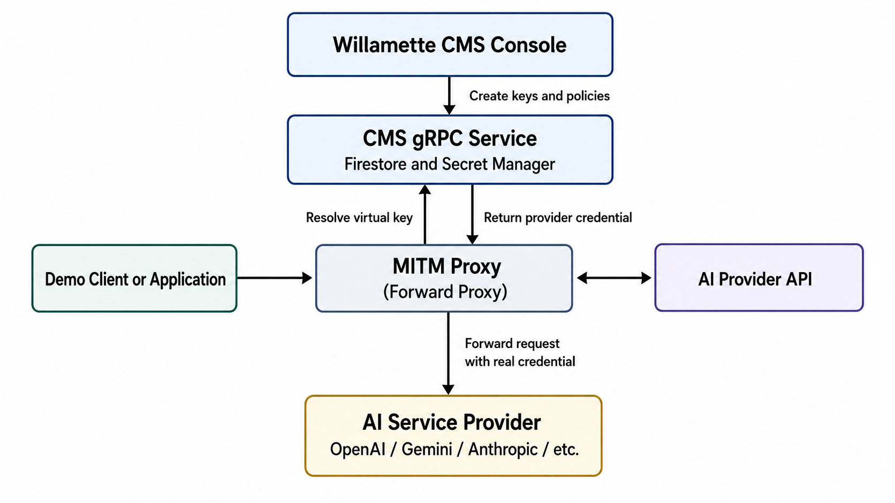

# ZAF Willamette

## License
ZAF Willamette is released under the terms in [LICENSE.md](LICENSE.md), with
patent use restrictions set out in [PATENT NOTICE.md](PATENT%20NOTICE.md).

ZAF Willamette provides managed virtual API keys and request inspection for
supported AI service providers.

## Description

ZAF Willamette is a reference implementation of the Zero Trust Access
Fabric (ZAF) last-mile access authorization framework, provided to
ground the architecture in working code. It is explicitly scoped as
an illustration of the model, not a canonical or production-complete
implementation. It ships with a set of example authenticator signals
chosen to demonstrate the pattern; implementors can create and register
their own authenticators using different signals entirely. For
background on the full ZAF model, see
[Introduction to ZAF.md](Introduction%20to%20ZAF.md).

Applications use a virtual API key instead of storing a real provider key.
The MITM Proxy intercepts the outbound request, sends the virtual key and
request metadata to the CMS gRPC Service, receives the corresponding real
provider credential, replaces the virtual credential, and forwards the
request to the provider.

## Components

| Component | Purpose |
|---|---|
| [CMS gRPC Service](grpc-service/) | Resolves virtual API keys and returns policy and provider credential data |
| [CMS Console](cms-console/) | Creates and manages virtual API keys and their policies |
| [MITM Proxy](mitm-proxy/) | Intercepts requests and replaces virtual credentials before forwarding |
| [Demo Client](demo-client/) | Tests direct provider calls and Willamette proxy calls |
| [Python SDK Test Client](test-clients/python-sdk/) | Tests direct and proxied requests using provider Python SDKs and documents certificate setup |

## Architecture

The following diagram shows how the Willamette components interact when
creating policies, resolving virtual credentials, and forwarding provider
requests.



```text
                     +----------------------+
                     |  Willamette CMS      |
                     |  Console             |
                     +----------+-----------+
                                |
                                | Create keys and policies
                                v
+----------------+      +-------+--------+      +-------------------+
| Demo Client or | ---> | MITM Proxy    | ---> | AI Provider API   |
| Application    |      +-------+--------+      +-------------------+
+----------------+              |
                                | Resolve virtual key
                                v
                     +----------+-----------+
                     | CMS gRPC Service     |
                     | Firestore and        |
                     | Secret Manager       |
                     +----------------------+
```

## Repository structure

```text
willamette/
├── README.md
├── grpc-service/
├── cms-console/
├── mitm-proxy/
│   └── plugins/
├── demo-client/
│   ├── app.py
│   ├── windows/
│   └── macos/
└── test-clients/
    └── python-sdk/
```

Each component has its own README with setup, configuration, testing,
deployment, and troubleshooting instructions.

## Typical workflow

1. Launch the CMS gRPC Service.
2. Launch the CMS Console.
3. Create a virtual API key and configure its policy.
4. Launch the MITM Proxy and connect it to the CMS gRPC Service.
5. Configure the Demo Client or another application to use the proxy.
6. Send a request using the virtual API key.
7. Verify that the proxy resolves and replaces the credential successfully.

## Current support

Willamette is under active development.

Current behavior depends on the exact CMS and MITM Proxy versions deployed.
Bearer-token replacement is supported by the imported proxy implementation.
Other provider credential formats, such as Gemini query parameters,
`x-goog-api-key`, or Anthropic `x-api-key`, require explicit support in the
proxy implementation.

## Security

- Do not commit provider API keys, passwords, service-account files, or
  private certificates.
- Keep real provider keys in Google Secret Manager.
- Restrict access to the CMS and proxy services.
- Do not expose the MITM Proxy publicly without firewall restrictions,
  authentication, or another access-control layer.
- Do not log authorization headers or provider credentials.

## Google Cloud

The current development deployment uses Google Cloud resources such as:

- Cloud Run for the CMS services
- Firestore for policy metadata
- Secret Manager for provider credentials
- Compute Engine for the MITM Proxy

Refer to the component READMEs for the exact deployment and configuration
steps.
